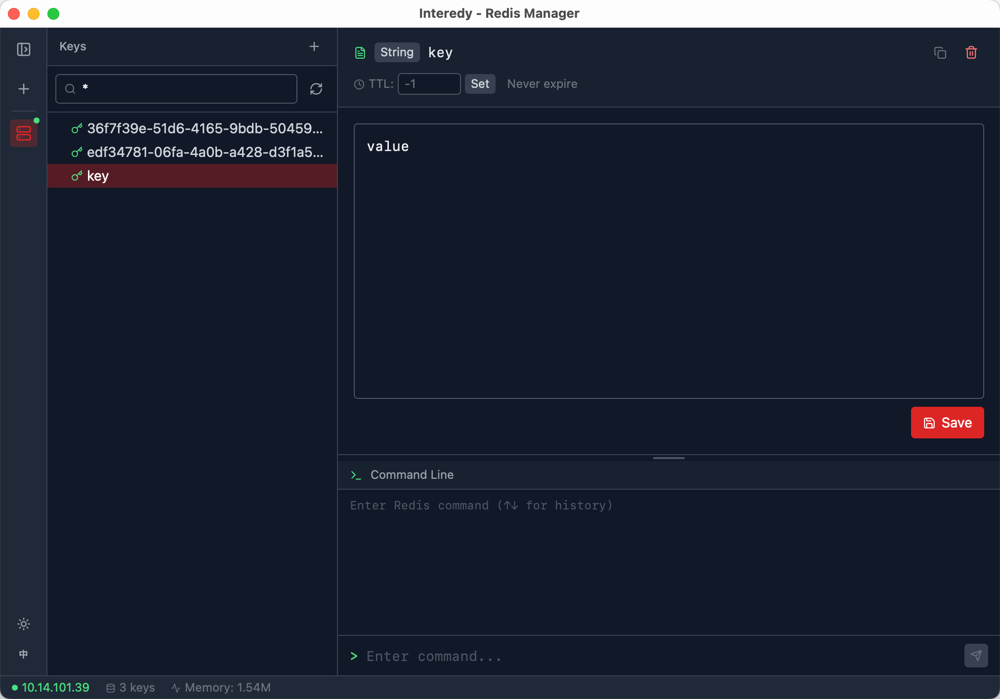

<p align="center">
  <a href="https://github.com/covoyage/interedy">
    
  </a>
</p>

**Interedy** -- A lightweight, fast, cross-platform Redis desktop manager.

[中文](./README.zh-CN.md)

<p align="center">
  
</p>
<p align="center">
  
</p>

## Features

- 🔌 **Connection Management** — Add/edit/delete Redis connections with password auth and database selection
- 🌳 **Key Tree Browser** — Hierarchical display by `:` delimiter with pattern search
- ✏️ **Data Editing** — View, edit, add and delete for String / Hash / List / Set / Sorted Set
- ⏱️ **TTL Management** — View/set expiry time, support PERSIST
- 💻 **Command Terminal** — Execute Redis commands freely with history and auto-completion
- 🔄 **Database Switching** — Switch between db0~db15 after connection
- 🎨 **Dual Themes** — Light / Dark, follows system preference
- 🌐 **i18n** — Chinese / English one-click switch
- ↔️ **Resizable Layout** — Drag to resize panels

## Tech Stack

| Layer | Tech |
|-------|------|
| Frontend | React 18 + TypeScript + TailwindCSS |
| Backend | Rust (Tauri 2.0) + redis-rs |
| Build | Vite + pnpm |

## Development

```bash
# Install dependencies
pnpm install

# Development mode
pnpm tauri dev

# Build for production
pnpm tauri build
```

## Configuration

Connection configs are persisted to `~/.config/interedy/connections.json`.

## License

[AGPL-3.0](./LICENSE)
