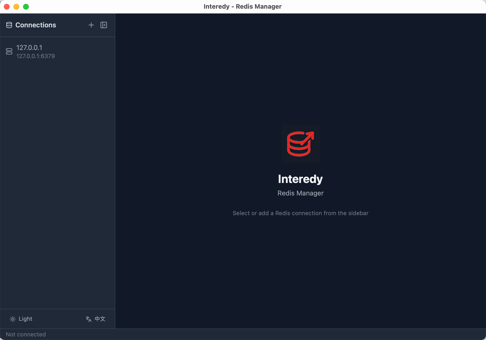

<p align="center">
  <a href="https://github.com/covoyage/interedy">
    
  </a>
</p>

**Interedy** -- 一款轻量、快速、跨平台的 Redis 桌面管理工具。

[English](./README.md)

<p align="center">
  
</p>

## 特性

- 🔌 **连接管理** — 添加/编辑/删除 Redis 连接，支持密码认证和数据库选择
- 🌳 **Key 树形浏览** — 按 `:` 分隔符层级展示，支持 pattern 搜索
- ✏️ **数据编辑** — String / Hash / List / Set / Sorted Set 五种类型的查看、编辑、增删
- ⏱️ **TTL 管理** — 查看/设置过期时间，支持 PERSIST 持久化
- 💻 **命令行终端** — 自由执行 Redis 命令，支持历史记录和命令自动补全
- 🔄 **数据库切换** — 连接后可切换 db0~db15
- 🎨 **双主题** — Light / Dark，自动跟随系统偏好
- 🌐 **国际化** — 中文 / English 一键切换
- ↔️ **可调整布局** — 面板可拖拽调整宽度/高度

## 技术栈

| 层级 | 技术 |
|------|------|
| 前端 | React 18 + TypeScript + TailwindCSS |
| 后端 | Rust (Tauri 2.0) + redis-rs |
| 构建 | Vite + pnpm |

## 开发

```bash
# 安装依赖
pnpm install

# 开发模式
pnpm tauri dev

# 构建发布
pnpm tauri build
```

## 配置

连接配置持久化至 `~/.config/interedy/connections.json`。

## License

[AGPL-3.0](./LICENSE)
